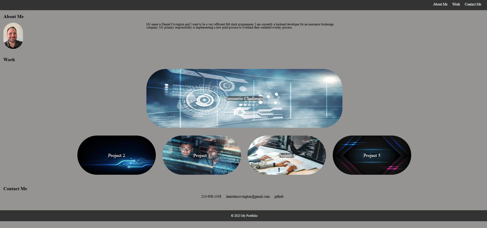

# My Portfolio
What all was done for creating my Portfolio 

* Created README, INDEX, reset.css, style.css, a Folder called Main that has folders for assets/css/images
* Created a navigation bar that when you select an option, it will take you to the corresponding section. 
* Added a profile picture of myself
* Wrote an about me
* Added my contact details
* Added a section with my work, that is mostly place holders at this point.
* Made the first project more promient then the rest.
* Created root variables in my CSS to allow easy changes in the future.
* Created transparent overlays for my project images.
* Added hover features throughout that include changing font color, and making it so images pop up.
* Added media queries to allow for easy viewing at any resolution. 

## Acceptance Criteria

GIVEN I need to sample a potential employee's previous work
*  WHEN I load their portfolio
THEN I am presented with the developer's name, a recent photo or avatar, and links to sections about them, their work, and how to contact them
*  WHEN I click one of the links in the navigation
THEN the UI scrolls to the corresponding section
*  WHEN I click on the link to the section about their work
THEN the UI scrolls to a section with titled images of the developer's applications
*  WHEN I am presented with the developer's first application
THEN that application's image should be larger in size than the others
*  WHEN I click on the images of the applications
THEN I am taken to that deployed application
* WHEN I resize the page or view the site on various screens and devices
THEN I am presented with a responsive layout that adapts to my viewport

##  Links

[Git Page](https://daniel-covington.github.io/My_Portfolio/)

[Git Hub](https://github.com/Daniel-Covington/My_Portfolio)

## Preview

The following image demonstrates the web application's appearance and functionality:

